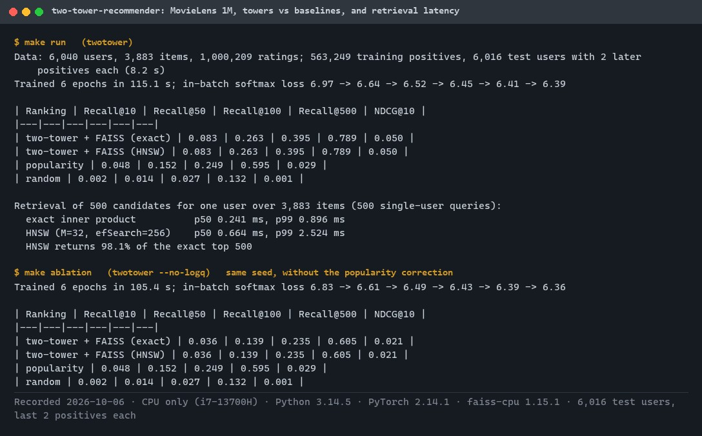
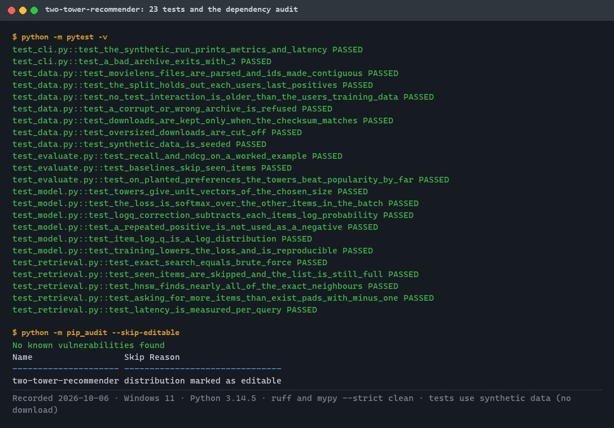
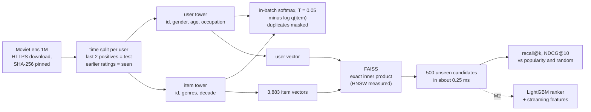
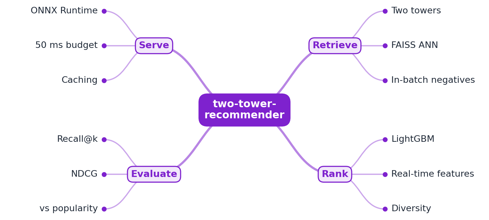
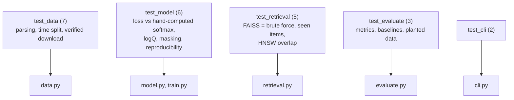

# two-tower-recommender

[](https://github.com/EquinoxWN/two-tower-recommender/actions/workflows/ci.yml)


> The 'recommended for you' problem, step one: a two-tower model and FAISS narrow thousands of movies to the best 500 in under a millisecond, beating popularity on MovieLens 1M (recall@10 0.083 vs 0.048).

Part of my **AI and Machine Learning** list · Python · core project

> Builds on: [streaming-feature-pipeline](https://github.com/EquinoxWN/streaming-feature-pipeline)

## Proof it works

Trained on MovieLens 1M and evaluated on each user's two latest positives, the towers retrieve personal recommendations: recall@10 of 0.083 against 0.048 for popularity, and 500 candidates in about 0.25 ms. The same model without the logQ popularity correction falls below popularity, which is why the correction is there:



23 tests pass (the loss checked against a hand-computed softmax, FAISS against brute force, the time split against leakage, the download against tampering), and the dependency audit is clean:



## Architecture

**What M1 runs today:**



**Full roadmap (M1 to M3):**



## How it works

_Steps 1, 2 and 6 are built and tested; the rest is on the [roadmap](#roadmap)._

1. A user tower and an item tower learn embeddings so that a dot product predicts interest; in-batch negatives keep training efficient.
2. Item embeddings go into a FAISS index that returns about 500 candidates in milliseconds.
3. A LightGBM ranker scores the candidates with richer features, including real-time ones from the streaming pipeline.
4. A re-rank step adds diversity so results are not all the same genre.
5. Models export to ONNX and serve behind FastAPI within a 50 ms budget.
6. Offline evaluation reports recall@k and NDCG against a popularity baseline.

## Tech stack

| Area | In M1 | Planned |
|---|---|---|
| Core | PyTorch two-tower model, FAISS (flat and HNSW) | LightGBM ranker, diversity re-rank |
| Data | MovieLens 1M (SHA-256 checked) | MovieLens 25M plus streaming features |
| Serve / eval | recall@k and NDCG@10 against popularity and random | FastAPI with ONNX Runtime within 50 ms |

Language: **Python** (3.11+, PyTorch and FAISS). Code in [`src/two_tower_recommender/`](src/two_tower_recommender): `data.py` (verified download, parsing, time split, synthetic data), `model.py` (towers and loss), `train.py`, `retrieval.py` (FAISS), `evaluate.py`, `cli.py`.

## Run it

**Prerequisites:** Python 3.11+. Runs on a CPU; `make setup` installs PyTorch (CPU build) and faiss-cpu.

```bash
python -m venv .venv && source .venv/bin/activate   # Windows: .venv\Scripts\activate
make setup      # install the package and dev tools
make lint       # ruff, ruff format, mypy --strict
make test       # 23 tests on synthetic data, no download
make run        # MovieLens 1M: download (verified), train 6 epochs (about 2 minutes on a laptop CPU), evaluate
make ablation   # the same without the logQ popularity correction
```

`twotower --synthetic` runs the whole pipeline on generated data in a few seconds. MovieLens is downloaded into `.tmp/data` and never committed (its licence does not allow redistribution).

## Tests and results

Full numbers and the analysis: [docs/results/m1.md](docs/results/m1.md).

| Check | Result |
|---|---|
| Tests (`make test`) | **23 passed**, 0 failed |
| MovieLens 1M, recall@10 | two-tower **0.083**, popularity 0.048, random 0.002 |
| MovieLens 1M, recall@500 (the candidate set) | two-tower **0.789**, popularity 0.595 |
| NDCG@10 | two-tower 0.050, popularity 0.029 |
| Without the logQ correction | recall@10 falls to 0.036, below popularity |
| Retrieval latency, 500 candidates, one user | 0.24 ms p50 and 0.90 ms p99 (exact); HNSW 0.66 ms p50 with 98.1% of the exact top 500 |
| Lint / audit | ruff, mypy `--strict` clean; `pip-audit`: no known vulnerabilities |

### Test map



## Roadmap

**M1** (≈15 h)
- [x] Write `docs/rfc/0001-design.md`: problem, goals, non-goals, chosen design
- [x] A user tower and an item tower learn embeddings so that a dot product predicts interest; in-batch negatives keep training efficient.
- [x] Item embeddings go into a FAISS index that returns about 500 candidates in milliseconds.

**M2** (≈20 h)
- [ ] A LightGBM ranker scores the candidates with richer features, including real-time ones from the streaming pipeline.
- [ ] A re-rank step adds diversity so results are not all the same genre.

**M3** (≈25 h)
- [ ] Models export to ONNX and serve behind FastAPI within a 50 ms budget.
- [x] Offline evaluation reports recall@k and NDCG against a popularity baseline.
- [ ] Publish the proof below with real numbers

## Proof

What this repo must show before it counts as done:

- Metric table vs baselines and a latency breakdown per stage.

| Result | Value |
|---|---|
| M3 proof above | Not measured yet (M3). Current M1 numbers: see [Tests and results](#tests-and-results). |

## Why it matters

- **Interview angle:** 'Design a recommender system' (YouTube or TikTok style).
- **Upstream I'd like to contribute to:** FAISS (Meta) or TorchRec.

## Design docs

- [RFC 0001: design](docs/rfc/0001-design.md)
- [ADR 0001: record architecture decisions](docs/adr/0001-record-architecture-decisions.md)
- [ADR 0002: in-batch negatives with logQ correction](docs/adr/0002-in-batch-negatives-with-logq-correction.md)
- [ADR 0003: time split and exact FAISS for M1](docs/adr/0003-time-split-and-exact-faiss-for-m1.md)
- [M1 results](docs/results/m1.md)

## Scope

This is a learning and portfolio system, not a hosted production service. Everything runs locally.

## Security and contributing

- Every GitHub Action is pinned to a commit SHA; workflows run read-only, without persisted credentials.
- Dependabot proposes dependency and action updates weekly.
- The dataset is downloaded only over HTTPS, capped at 50 MB, and refused unless its SHA-256 matches the pinned value; CI runs `pip-audit` on every push.
- Report vulnerabilities privately: see [SECURITY.md](SECURITY.md). To contribute, see [CONTRIBUTING.md](CONTRIBUTING.md).

## License

MIT, see [LICENSE](LICENSE).
